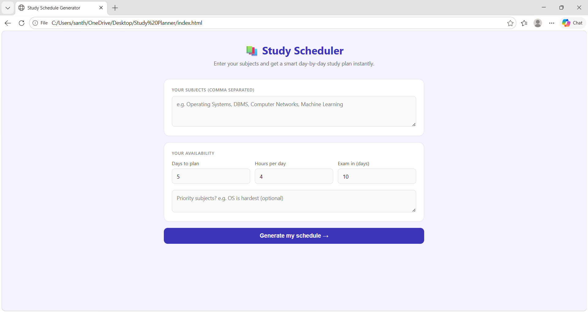
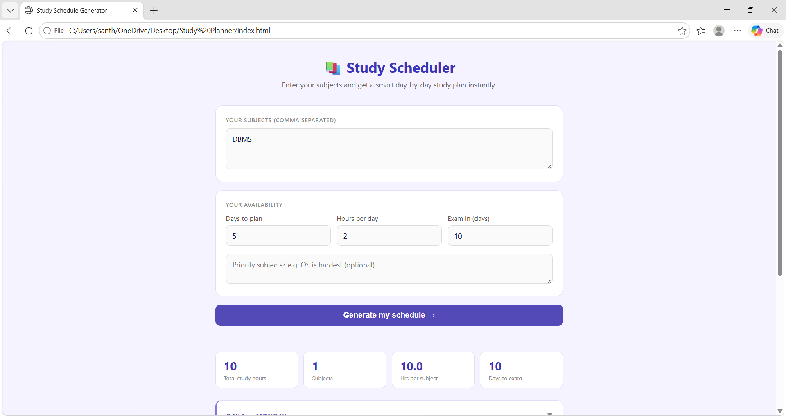
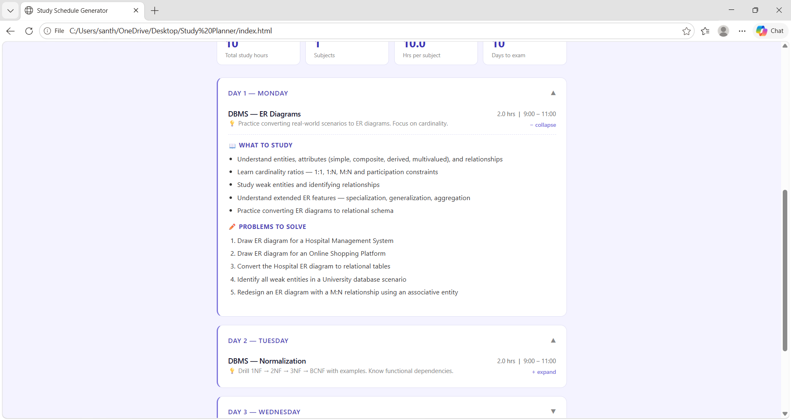
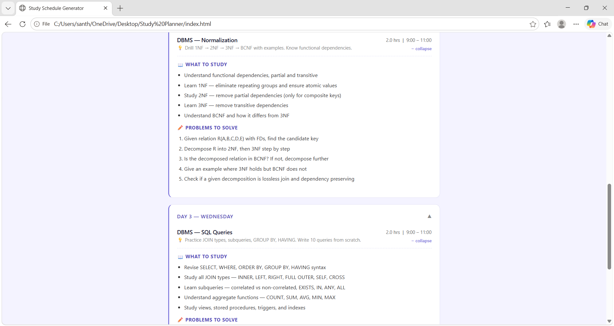

# 📚 Study Schedule Generator

A smart and interactive web application that automatically creates a personalized study timetable based on subjects, available study hours, exam timeline, and priority topics.

🔗 GitHub Repository:  
https://github.com/SanthoshiInavolu/Study-Schedule-Generator

---

## 🚀 Features

- Generate personalized day-wise study schedules
- Priority-based subject handling
- Topic-wise study planning
- Practice questions and revision tasks
- Expandable and collapsible study sessions
- Smart exam preparation tips
- Responsive and clean UI

---

## 🛠️ Tech Stack

- HTML5
- CSS3
- JavaScript (Vanilla JS)

---

## 📂 Project Structure

```bash
Study-Schedule-Generator/
│
├── index.html
├── scheduler.js
├── README.md
├── images/
│   ├── home.png
│   ├── subject.png
│   ├── schedule.png
│   └── daywise.png
```

---

## 📌 How It Works

1. Enter subjects separated by commas
2. Select:
   - Number of study days
   - Study hours per day
   - Days remaining for the exam
3. Add priority subjects (optional)
4. Click **Generate my schedule**
5. The app automatically creates a detailed study timetable

---

## 🧠 Smart Scheduling Logic

The scheduler:
- Distributes subjects evenly across available study days
- Prioritizes difficult subjects if specified
- Assigns predefined study topics automatically
- Generates practice questions and revision tasks
- Provides exam-focused preparation tips

---

## 📖 Supported Subjects

Currently optimized for:
- Operating Systems (OS)
- DBMS
- Computer Networks
- DSA / Algorithms

For unknown subjects, the application automatically generates a default study plan.

---

## ✨ UI Highlights

- Minimal and modern design
- Interactive expandable sections
- Responsive layout
- Clean schedule cards
- Quick statistics dashboard

---

## 📸 Screenshots

### 🏠 Home Page


---

### 📚 Subject Input Section


---

### 📅 Generated Schedule


---

### 📝 Day-wise Study Plan


---

## 🔮 Future Improvements

- Local storage support
- Export schedule as PDF
- Dark mode
- AI-generated personalized topics
- Mobile app support
- Custom study timing selection

---

## ▶️ Run Locally

1. Clone the repository

```bash
git clone https://github.com/SanthoshiInavolu/Study-Schedule-Generator.git
```

2. Open the project folder

```bash
cd Study-Schedule-Generator
```

3. Open `index.html` in your browser

---

## 👩‍💻 Author

Developed by **Santhoshi Inavolu**